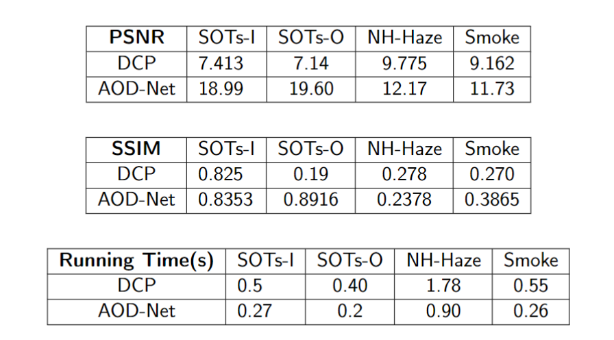

# Comparative Analysis of Image Dehazing Algorithms

## Overview
This repository contains implementations and comparitive analysis of two image dehazing algorithms: **Dark Channel Prior (DCP)** and **All-In-One Dehazing Network (AOD-Net)**. These algorithms aim to restore image clarity by reducing haze and enhancing visual quality in images affected by atmospheric disturbances.

## Datasets
The datasets used for evaluating the dehazing algorithms are as follows:

1. **NH-Haze Dataset:**
    - **Description:** A dataset containing non-homogeneous hazy images with corresponding ground truth.
    - **Link:** [NH-Haze Dataset](https://data.vision.ee.ethz.ch/cvl/ntire20/nh-haze/)

2. **SMoke Dataset:**
    - **Description:** A dataset containing images affected by smoke with corresponding ground truth.
    - **Link:** [Smoke Dataset](https://www.kaggle.com/datasets/ahanray/smoke-real-dense-non-uniform-fog)

3. **SOTS-I Dataset:**
    - **Description:** Synthetic Objective Testing Set for indoor hazy images with corresponding ground truth.
    - **Link:** [SOTS-I Dataset](https://sites.google.com/view/reside-dehaze-datasets/reside-v0)

4. **SOTS-O Dataset:**
    - **Description:** Synthetic Objective Testing Set for outdoor hazy images with corresponding ground truth.
    - **Link:** [SOTS-O Dataset](https://sites.google.com/view/reside-dehaze-datasets/reside-v0)

These datasets provide a comprehensive evaluation framework for comparing the effectiveness of different dehazing techniques.

## Results

Below are examples of the dehazing results using the provided algorithms:

For more detailed results, check the repective Output folders.

## Comparison Metrics

The performance of the dehazing algorithms is evaluated using the following metrics:

## Contents
- `AOD_Net.ipynb`: Jupyter Notebook implementing the AOD-Net deep learning-based dehazing method.
- `DCP.ipynb`: Jupyter Notebook implementing the Dark Channel Prior algorithm for dehazing.
- `README.md`: This file, providing documentation and instructions.

## Prerequisites
To run the provided notebooks, ensure you have the following dependencies installed:

1. **Python Libraries:**
   - `numpy`: For numerical computations.
   - `opencv-python`: For image processing.
   - `matplotlib`: For visualizing results.
   - `torch` and `torchvision`: Required for running the AOD-Net deep learning model.

2. **Optional Tools:**
   - A Jupyter Notebook environment such as JupyterLab or VS Code with the Jupyter extension.

## Files Description
### 1. `AOD_Net.ipynb`
- Implements the All-In-One Dehazing Network (AOD-Net) using PyTorch.
- Includes:
  - Model architecture.
  - Pre-trained model loading (if available).
  - Testing on sample hazy images.

### 2. `DCP.ipynb`
- Implements the Dark Channel Prior (DCP) method using OpenCV.
- Includes:
  - Transmission map estimation.
  - Atmospheric light calculation.
  - Image dehazing using the physical model.

