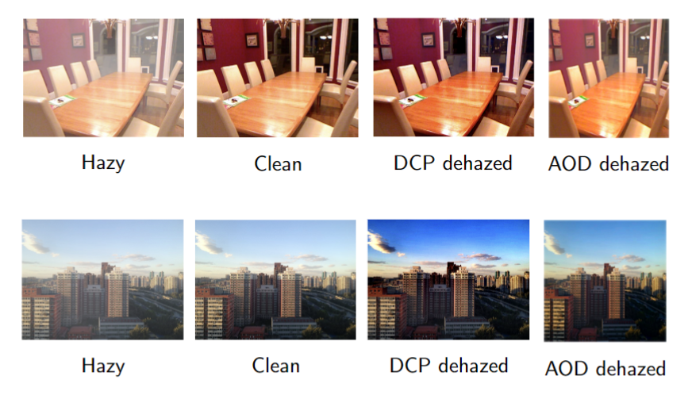
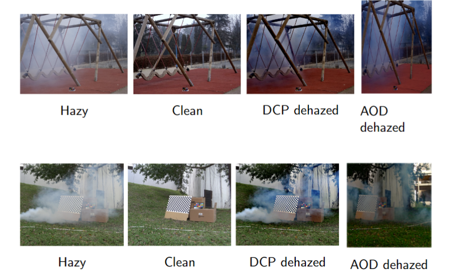

# Comparative Analysis of Image Dehazing Algorithms

## Overview
This repository contains implementations of two image dehazing algorithms: **Dark Channel Prior (DCP)** and **All-In-One Dehazing Network (AOD-Net)**. These algorithms aim to restore image clarity by reducing haze and enhancing visual quality in images affected by atmospheric disturbances.

### Example Output

Below are examples of the dehazing results using the provided algorithms:




## Contents
- `AOD_Net.ipynb`: Jupyter Notebook implementing the AOD-Net deep learning-based dehazing method.
- `DCP.ipynb`: Jupyter Notebook implementing the Dark Channel Prior algorithm for dehazing.
- `README.md`: This file, providing documentation and instructions.

## Prerequisites
To run the provided notebooks, ensure you have the following dependencies installed:

1. **Python Libraries:**
   - `numpy`: For numerical computations.
   - `opencv-python`: For image processing.
   - `matplotlib`: For visualizing results.
   - `torch` and `torchvision`: Required for running the AOD-Net deep learning model.

2. **Optional Tools:**
   - A Jupyter Notebook environment such as JupyterLab or VS Code with the Jupyter extension.

## How to Run
1. Clone the repository:
   ```bash
   git clone <repository-url>
   cd <repository-folder>
   ```

2. Install the required Python dependencies:
   ```bash
   pip install -r requirements.txt
   ```

3. Open the desired notebook:
   ```bash
   jupyter notebook AOD_Net.ipynb
   # or
   jupyter notebook DCP.ipynb
   ```

4. Follow the instructions in the notebook to run the dehazing algorithms on sample images.

## Files Description
### 1. `AOD_Net.ipynb`
- Implements the All-In-One Dehazing Network (AOD-Net) using PyTorch.
- Includes:
  - Model architecture.
  - Pre-trained model loading (if available).
  - Testing on sample hazy images.

### 2. `DCP.ipynb`
- Implements the Dark Channel Prior (DCP) method using OpenCV.
- Includes:
  - Transmission map estimation.
  - Atmospheric light calculation.
  - Image dehazing using the physical model.

## Example Results
The notebooks include visualizations of dehazed images compared to their hazy counterparts. Adjust parameters as needed to optimize results for specific datasets.


